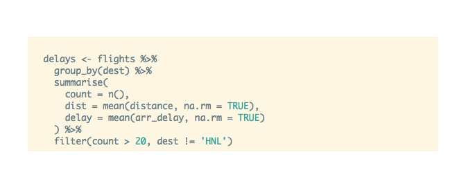

<link href="http://fonts.googleapis.com/css?family=Lato:300,700,300italic|Inconsolata" rel="stylesheet" type="text/css"> <link href='docs/style.css' rel='stylesheet' type='text/css'>

highlighter
===========

htmlwidgets wrapper for highlight.js

This package is an htmlwidget wrapper for an excelent highlight.js library. You can learn more about javascript library <https://highlightjs.org/>.

For now it only support R code chunks.

<!-- #Basic tutorial article is available on [Appsilon Data Science blog](your_future_art_link). -->
<!-- Live demo link below 
<p style="text-align: center; font-size: x-large;">
<a href="http://appsilondatascience.com/demo">Live demo</a>
</p>-->

Source code
-----------

This library source code can be found on [Appsilon Data Science's](http://appsilondatascience.com) Github: <br> <https://github.com/Appsilon/highlighter>

<script>
document.write('<div class="logo"><a href="http://appsilondatascience.com"></a></div>')
</script>
How to install?
---------------

**Note! This library is still in its infancy. Api might change in the future.**

At the moment it's possible to install this library through [devtools](https://github.com/hadley/devtools).

    devtools::install_github("Appsilon/highlighter")

To install [previous version]() you can run:

    devtools::install_github("Appsilon/highlighter", ref = "0.1.0")

Example
-------

``` r
highlighter::highlight("
  delays <- flights %>% 
    group_by(dest) %>% 
    summarise(
      count = n(),
      dist = mean(distance, na.rm = TRUE),
      delay = mean(arr_delay, na.rm = TRUE)
    ) %>% 
    filter(count > 20, dest != 'HNL')
", width = "400px", height = "200px")
```



How to contribute?
------------------

If you want to contribute to this project please submit a regular PR, once you're done with new feature or bug fix.<br>

**Changes in documentation**

Both repository **README.md** file and an official documentation page are generated with Rmarkdown, so if there is a need to update them, please modify accordingly a **README.Rmd** file and run a **build\_readme.R** script to compile it.

Troubleshooting
---------------

We used the latest versions of dependencies for this library, so please update your R environment before installation.

However, if you encounter any problems, try the following:

1.  Up-to-date R language environment

Future enhacements
------------------

-   CRAN release
-   Support for other languages
-   Support for other themes

Appsilon Data Science
=====================

<script>
document.write('<div class="subheader"> We Provide End-to-End Data Science Solutions </div>  <div class="logo"><a href="http://appsilondatascience.com"></a></div>');
</script>
Get in touch [dev@appsilondatascience.com](dev@appsilondatascience.com)

<script>
document.write('<a href="https://github.com/Appsilon/highlighter"></a>')
</script>
